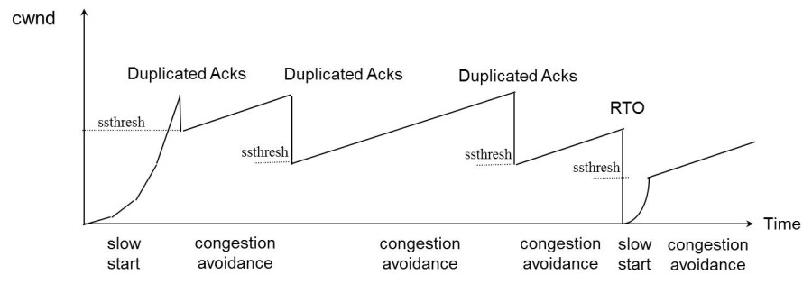

# TCP 拥塞控制

## 为什么需要拥塞控制？
在[TCP概览](./TCP.md)一文中说到，TCP通过滑动窗口机制来做流控，但TCP觉得这还不够，因为滑动窗口是发送方和接收方两个端点关注的事情，他们并不知道在传输的网络中间发生了什么。TCP的设计者认为，TCP还应该更聪明的知道整个网络上的事。

**如果网络上的延时突然增加，那么，TCP对这个事做出的应对只有重传数据，但是，重传会导致网络的负担更重，于是会导致更大的延迟以及更多的丢包，于是，这个情况就会进入恶性循环被不断地放大。试想一下，如果一个网络内有成千上万的TCP连接都这么行事，那么马上就会形成“网络风暴”，TCP这个协议就会拖垮整个网络。**

## 如何处理拥塞情况
**TCP不是一个自私的协议，当拥塞发生的时候，要做自我牺牲。就像交通阻塞一样，每个车都应该把路让出来，而不要再去抢路了。**

拥塞控制主要是四个算法，依次递进执行
1. 慢启动
2. 拥塞避免
3. 拥塞发生
4. 快速恢复

### 慢启动算法
慢启动的意思是，刚刚加入网络的连接，一点一点地提速，不要一上来就像那些特权车一样霸道地把路占满。大致实现流程如下：
1. 连接建好的开始先初始化cwnd = 1，表明可以传一个MSS大小的数据。
2. 每当收到一个ACK，cwnd++; 呈线性上升
3. 每当过了一个RTT，cwnd = cwnd*2; 呈指数让升
4. 还有一个ssthresh（slow start threshold），是一个上限，当cwnd >= ssthresh时，就会进入“拥塞避免算法”（后面会说这个算法）

### 拥塞避免算法
前面说过，还有一个ssthresh（slow start threshold），是一个上限，当cwnd >= ssthresh时，就会进入“拥塞避免算法”。一般来说ssthresh的值是65535，单位是字节，当cwnd达到这个值时后，算法如下：

1. 收到一个ACK时，cwnd = cwnd + 1/cwnd

2. 当每过一个RTT时，cwnd = cwnd + 1

这样就可以避免增长过快导致网络拥塞，慢慢的增加调整到网络的最佳值。很明显，是一个线性上升的算法。

### 拥塞发生时的算法

当丢包的时候，会有两种情况

1. 等到RTO超时，重传数据包。TCP认为这种情况太糟糕，反应也很强烈。
- sshthresh =  cwnd /2
- cwnd 重置为 1
- 进入慢启动过程

2. 快速重传（Fast Retransmit）算法，也就是在收到3个duplicate ACK时就开启重传，而不用等到RTO超时。
- TCP Tahoe的实现和RTO超时一样。
- TCP Reno的实现是： 
       - cwnd = cwnd /2
       - sshthresh = cwnd
       - 进入快速恢复算法——Fast Recovery

上面我们可以看到RTO超时后，sshthresh会变成cwnd的一半，这意味着，如果cwnd<=sshthresh时出现的丢包，那么TCP的sshthresh就会减了一半，然后等cwnd又很快地以指数级增涨爬到这个地方时，就会成慢慢的线性增涨。

### 快速恢复算法
快速重传和快速恢复算法一般同时使用。快速恢复算法是认为，你还有3个Duplicated Acks说明网络也不那么糟糕，所以没有必要像RTO超时那么强烈。 注意，正如前面所说，**进入Fast Recovery之前，cwnd 和 sshthresh已被更新：**
- cwnd = cwnd /2
- sshthresh = cwnd

然后，真正的Fast Recovery算法如下：
- cwnd = sshthresh  + 3 * MSS （3的意思是确认有3个数据包被收到了）
- 重传Duplicated ACKs指定的数据包
- 如果再收到 duplicated Acks，那么cwnd = cwnd +1
- 如果收到了新的Ack，那么，cwnd = sshthresh ，然后就进入了拥塞避免的算法了。

### 算法示意图
