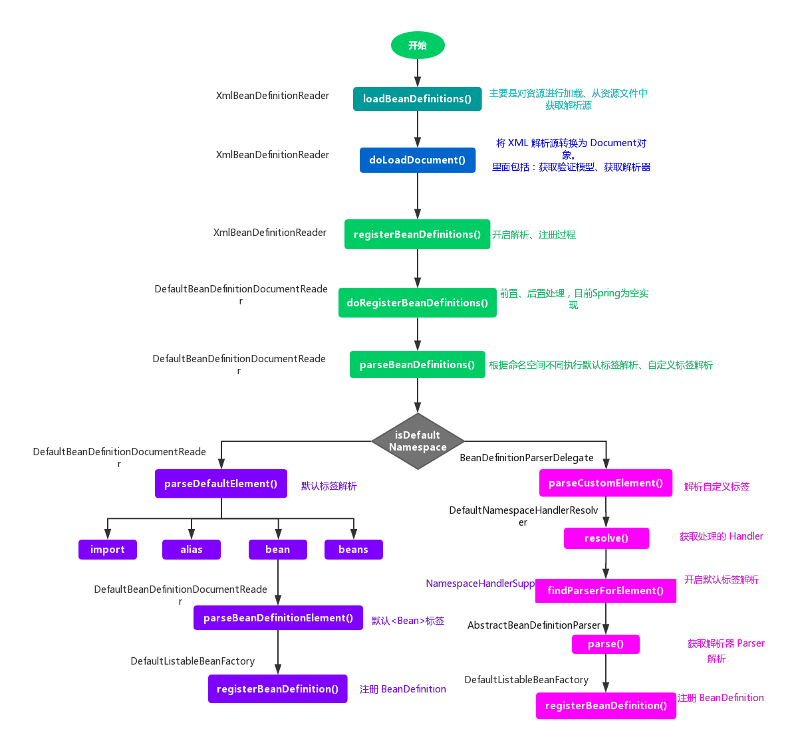

# Spring IOC 容器初始化简述
## 概述
IOC 容器的初始化过程分为三步骤：Resource 定位、BeanDefinition 的载入和解析，BeanDefinition 注册。


1. Resource 定位。我们一般用外部资源来描述 Bean 对象，所以在初始化 IOC 容器的第一步就是需要定位这个外部资源。
2. BeanDefinition 的载入和解析。装载就是 BeanDefinition 的载入。BeanDefinitionReader 读取、解析 Resource 资源，也就是将用户定义的 Bean 表示成 IOC 容器的内部数据结构：BeanDefinition。
3. BeanDefinition 注册。向IOC容器注册在第二步解析好的 BeanDefinition，这个过程是通过 BeanDefinitionRegistery 接口来实现的。**在 IOC 容器内部其实是将第二个过程解析得到的 BeanDefinition 注入到一个 HashMap 容器中**，IOC 容器就是通过这个 HashMap 来维护这些 BeanDefinition 的。**在这里需要注意的一点是这个过程并没有完成依赖注入，依赖注册是发生在应用第一次调用 getBean() 向容器索要 Bean 时。** 当然我们可以通过设置预处理，即对某个 Bean 设置 lazyinit 属性，那么这个 Bean 的依赖注入就会在容器初始化的时候完成。

这段代码是 Spring 中编程式使用 IOC 容器，通过这四段简单的代码，我们可以初步判断 IOC 容器的使用过程。
```Java
// 根据 Xml 配置文件创建 Resource 资源对象。ClassPathResource 是 Resource 接口的子类，bean.xml 文件中的内容是我们定义的 Bean 信息。
ClassPathResource resource = new ClassPathResource("bean.xml");
// 创建一个 BeanFactory。DefaultListableBeanFactory 是 BeanFactory 的一个子类，BeanFactory 作为一个接口，其实它本身是不具有独立使用的功能的，而 DefaultListableBeanFactory 则是真正可以独立使用的 IOC 容器，它是整个 Spring IOC 的始祖。
DefaultListableBeanFactory factory = new DefaultListableBeanFactory();
// 创建 XmlBeanDefinitionReader 读取器，用于载入 BeanDefinition 。
XmlBeanDefinitionReader reader = new XmlBeanDefinitionReader(factory);
// 开启 Bean 的载入和注册进程，完成后的 Bean 放置在 IOC 容器中。
reader.loadBeanDefinitions(resource);
```
## 流程概览


### 参考资料
http://cmsblogs.com/