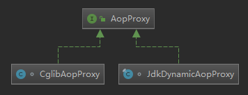

# Spring-AOP 究竟如何实现？ 等同于 AspectJ 吗？
初次使用 Spring AOP 功能的时候，我们总是写一个 <aop:aspectj-autoproxy /> 的标签在 XML 文件里，甚至当我们使用@Aspect或@Pointcut注解时，import进来的包名都是org.aspectj。以至于很长一段时间都在迷惑我们 Spring AOP 是否就是基于 AspectJ 实现的。

**其实不然 Spring AOP ≠ AspectJ，不如我们先了解一下AOP到底是什么。**

## 什么是AOP ？
**AOP 可以说是OOP（Object-Oriented Programing，面向对象编程）的补充，OOP中模块化的关键单元是类，而在AOP中，模块化单元是切面。** OOP引入了多态概念来建立一种对象层次结构，用来模拟基于父对象公共行为的一个集合。当我们需要为分散的对象引入公共行为的时候，OOP则显得无能为力了。也就是说，OOP允许你定义从上到下的关系，但不适合定义从左到右的关系。例如日志功能，打印日志的代码可能出现在多个类中，而这些类的可能毫无关系，这种代码通常被称为“横切代码”。

AOP 技术则非常适合这种操作，它可以剖开封装的对象内部，将我们需要的代码切入其中。简单地说，就是将那些与业务无关，却为业务模块所共同调用的逻辑或责任封装起来，便于减少系统的重复代码，降低模块间的耦合度，并有利于未来的可操作性和可维护性。

## AOP 如何实现 ？
我们在谈论Spring的特性的时候总是说到 IoC(Inversion of Control) 和AOP，IoC固然是一个非常惊艳的思想，它也是Spring核心思想。但是对于AOP来说，虽然Spring广为人知的特性中包含了它，但它并不是Spring独有的，脱离Spring这样的框架之后，AOP依然可以实现。

实现 AOP 的技术主要分为两类：

1. 动态代理，在内存中的对象生成之前，截取对象创建代理，使代理对象取代原有对象来执行后续操作。
2. 静态织入，通过某种工具介入代码的编译期，直接修改原有的类。

由此可以看出，即使只有main方法来启动的程序，**只要合理的实现动态代理或者修改编译器**，是可以做到AOP效果的。同样，如果使用某种编译器来替代 javac 编译器，也可以做到AOP效果。

## Spring 提供了两种 AOP 支持
1. Schema-based AOP Support
2. @AspectJ Support

### Schema-based
Spring 提供了一个新的XML命名空间aop，以此来定义AOP中的一些操作，例如：
```xml
<aop:aspect id="beforeExample" ref="aBean">
    <aop:before
        pointcut-ref="dataAccessOperation"
        method="doAccessCheck"/>
</aop:aspect>
```

### @AspectJ
```java
@Configuration
@EnableAspectJAutoProxy
public class AppConfig {}
```

```xml
<aop:aspectj-autoproxy/>
```

以上两种方式二选一来开启Spring-AOP 的注解模式，开启之后：

```java
@Aspect
public class LogAspect{
	@Pointcut("execution(public * *(..))")
	private void anyPublicOperation() {}
    
    @Before("anyPublicOperation()")
    public void before(){
        // do something 
    }
}

```

## 那么 Spring-AOP 和 AspectJ 是什么关系 ？

下面我们将简单介绍 AspectJ 的由来以及实现原理，再从源码角度深入分析一下Spring AOP 是如何实现的。

### AspectJ 如何工作
AspectJ其实是eclipse基金会的一个项目，官网就在eclipse官网里。aspectJ的几种标准的使用方法：
1. 编译时织入，利用ajc编译器替代javac编译器，直接将源文件(java或者aspect文件)编译成class文件并将切面织入进代码。
2. 编译后织入，利用ajc编译器向javac编译器编译后的class文件或jar文件织入切面代码。
3. 加载时织入，不使用ajc编译器，利用aspectjweaver.jar工具，使用java agent代理在类加载期将切面织入进代码。


### Spring AOP 如何工作
Spring 是一个容器，装载Bean 对象的容器。那么这个容器一定涉及到对Bean对象的加载、实例化等操作。我们从这个角度来看，其实普通代码利用动态代理并不能提供很好的 AOP 功能，因为除了写切面代码之外，**我们还需要将代理类耦合进被代理类的调用阶段。** Spring 的优点就在这里，这个容器可以帮我们控制对象的生命周期，我们可以不用关心应该在何时何地去冗余这段动态代理代码。

Spring bean 对象实例化过程通过 AbstractAutowireCapableBeanFactory 中一个方法 createBean 开始。

```java
protected Object createBean(beanName, mbd, args) { 
    RootBeanDefinition mbdToUse = mbd;  
    // 这个方法主要是解析 bean definition 的 class 类，并将已经解析的 Class 存  在 bean definition 中以供后面使用
    Class<?> resolvedClass = resolveBeanClass(mbd, beanName);
    if (resolvedClass != null && !mbd.hasBeanClass() && mbd.getBeanClassName() != null) {
    	mbdToUse = new RootBeanDefinition(mbd);
    	mbdToUse.setBeanClass(resolvedClass);
    }   
    try {
    	mbdToUse.prepareMethodOverrides();
    } catch (BeanDefinitionValidationException ex) {
    	// catch something
    }   
    try {
    	// 为BeanPostProcessors提供返回代理而不是目标bean实例的机会
    	// 这里是实现AOP的重要逻辑之一
    	Object bean = resolveBeforeInstantiation(beanName, mbdToUse);
    	if (bean != null) {
    	    return bean;
    	}
    } catch (Throwable ex) {
    	// catch something
    }   
    try {
    	// 这里开始实例化bean
    	Object beanInstance = doCreateBean(beanName, mbdToUse, args);
    	return beanInstance;
    } catch (BeanCreationException |    ImplicitlyAppearedSingletonException ex) {
    	// do throw
    } catch (Throwable ex) {
    	// do throw
    }
}
```
首先我们可以看到真正的实例化进程在 doCreateBean 方法中，而 resolveBeforeInstantiation 这个方法是实现 AOP 的重点，它在实例化进程开始之前先执行。它的核心代码主要是调用了两个寻找 beanPostProcessor 并调用的方法，其中第一个方法用于寻找 InstantiationAwareBeanPostProcessor。 

接下来不妨看一下 InstantiationAwareBeanPostProcessor 接口有哪些实现，它的直接实现有两个：
1. SmartInstantiationAwareBeanPostProcessor
2. CommonAnnotationBeanPostProcessor

第二个主要是提供javax包下的一些注解的支持，暂且不讲。

第一个 **SmartInstantiationAwareBeanPostProcessor** 是一个接口，它有一个很重要的实现类 **AbstractAutoProxyCreator**。这个类中有一个 postProcessBeforeInstantiation @Override方法，其中核心是调用了一个 **createProxy** 方法。
```java
/**
 * 为给定的bean 创建 AOP 代理
 */
protected Object createProxy(beanName, specificInterceptors, targetSource) {
    
    // 省略非核心代码
    
    ProxyFactory proxyFactory = new ProxyFactory();
    // 根据指定的 beanName，获取这个 bean 对象中所有的 advisor
    Advisor[] advisors = buildAdvisors(beanName, specificInterceptors);
    proxyFactory.addAdvisors(advisors);
    proxyFactory.setTargetSource(targetSource);
    
    // 省略非核心代码

    return proxyFactory.getProxy(getProxyClassLoader());
}
```
对于 advisor 的深入我们暂且略过，可以简单的认为它是“将某个动作切入到某个point的代码的抽象”。

ProxyFactory 最后调用到了 AopProxy 中的 getProxy 方法。
```java
public interface AopProxy {
	Object getProxy();

	Object getProxy(@Nullable ClassLoader classLoader);
}
```
AopProxy 是一个接口，它有两个实现类。



getProxy 方法根据传入不同的 classloader 调用了两个不同类中的 getProxy 方法，这两个类的名字看到大家就一目了然。分别是 **JdkDynamicAopProxy** 和 **CglibAopProxy 。**

再回过头来看一下 createBean 方法
```java
Object bean = resolveBeforeInstantiation(beanName, mbdToUse);
    if (bean != null) {
        return bean;
    }
```
如果获取到了代理对象，则直接返回代理对象，不执行 doCreateBean 方法了。

## 结论
Spring 官方文档中说到
>Spring AOP never strives to compete with AspectJ to provide a comprehensive AOP solution. We believe that both proxy-based frameworks such as Spring AOP and full-blown frameworks such as AspectJ are valuable and that they are complementary, rather than in competition. 

>Spring AOP从未努力与AspectJ竞争，以提供更全面的AOP解决方案。我们认为，基于代理的框架（如Spring AOP）和完整的框架（如AspectJ）都很有价值，而且它们是互补的，而不是竞争。

Spring同时也支持Full AspectJ 框架中Load-time weaving (LTW) 织入方式。如果有兴趣可以参考Spring 和 AspectJ 的文档。

至此就是 Spring AOP 实现原理的分析和 AspectJ 实现原理的简单说明。通过代码分析不难看出，Spring AOP 实际上是基于动态代理的方式实现，但它使用了 AspectJ 的语法来定义切面，使得编码更加清晰。